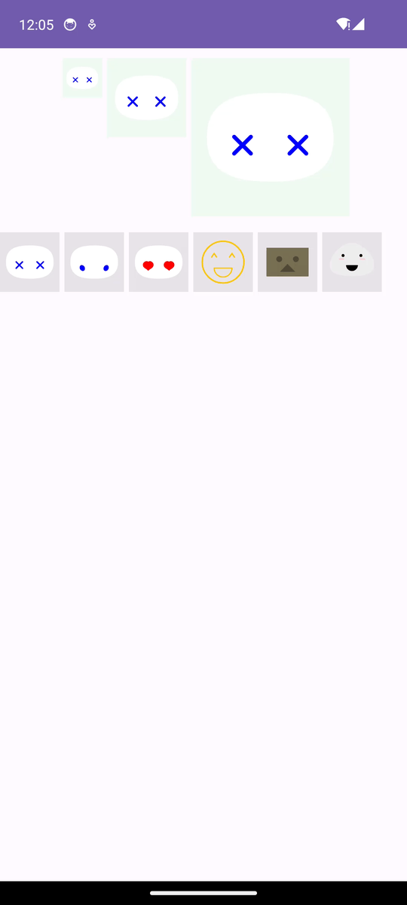

## demo-robot
A demo of robot animation based on bezier curves.
Four cubic beziers form shapes, shapes form expressions, and expressions can form poses...

## Screenshots

## To Do：
* Frequent object creation
* Difficulty in building animations

## Document Link
>[我用 Bézier 曲线创造了一个机器人](https://www.dafaycoding.com/article/android-basic-bezier-robot)

>[使用四段三次 Bézier 曲线拟合圆](https://www.dafaycoding.com/article/android-basic-bezier)

